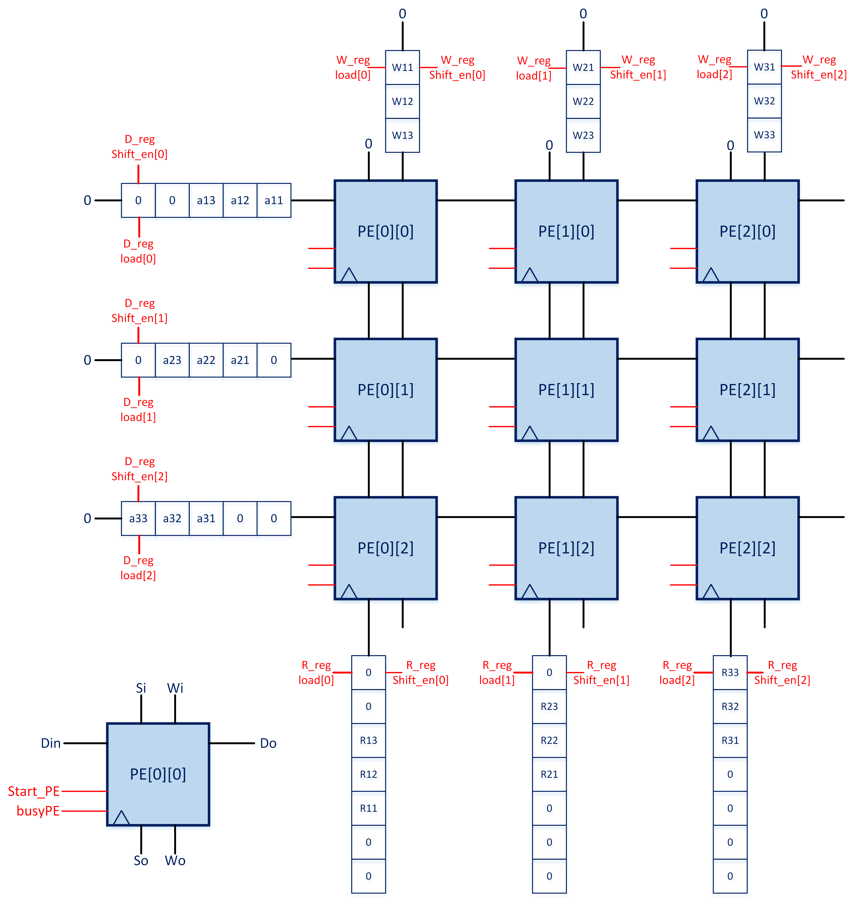
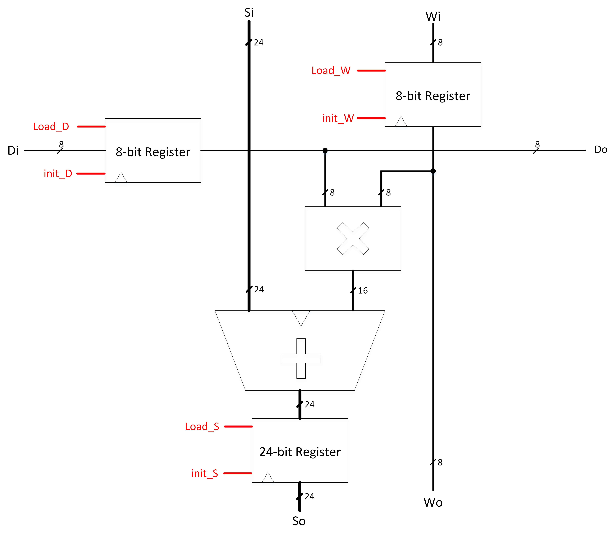
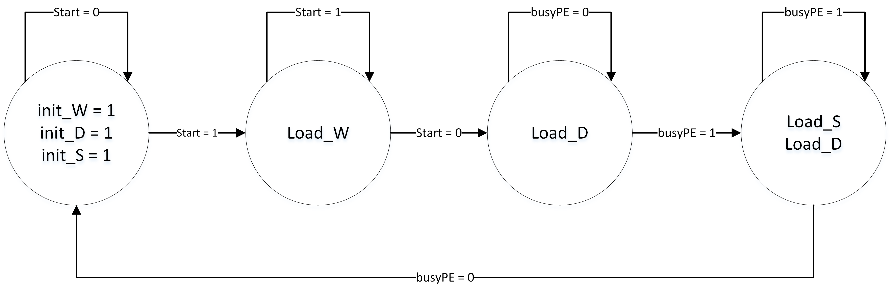
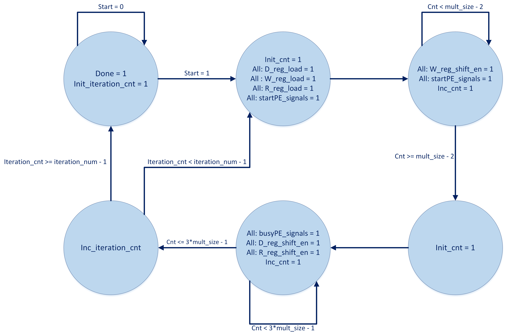

# 2D Weight-Stationary Systolic Array for Matrix Multiplication

## Overview

This project demonstrates a 2D weight-stationary systolic architecture for matrix multiplication, implemented in SystemC. Designed to be efficient in handling matrix multiplications, this project features vivid illustrations and detailed documentation to clarify the design flow and operation. 

This systolic array leverages a grid of interconnected Processing Elements (PEs) that execute Multiply and Accumulate (MAC) operations, allowing for efficient computation in a parallelized manner. The Bus Functional Model (BFM) and Register Transfer Level (RTL) implementations further illustrate the flexibility of this architecture.

## Key Features

- **Vivid Illustrations**: Comprehensive images and diagrams clarify the design flow and architecture.
- **Dynamic Array Size**: By using SystemC’s template functionality, this design allows for adaptable matrix multiplier configurations.
- **Detailed Documentation**: A step-by-step design flow, including descriptions of control signals, PE operations, and clock cycles.
- **BFM and RTL Implementations**: Multiple modeling approaches (BFM and RTL) highlight different design perspectives and offer flexibility for system-level testing.

## Architecture

### Processing Element (PE) Design

Each PE in the array is designed to perform MAC operations. It has:
- **Inputs**: 
  - Two 8-bit inputs (`Di` and `Wi`), representing the data and weight, respectively.
  - A 24-bit accumulator input (`Si`).
  
  - Control signals `StartPE` and `BusyPE`.
  
- **Functionality**: Upon receiving a start signal, each PE multiplies `Di` and `Wi`, accumulates the result with `Si`, and stores the result.

### 2D Matrix Multiplier

- **Configuration**: 
  - This design supports flexible matrix sizes through templates in SystemC.
  - A sample 3x3 matrix multiplier setup illustrates the architecture, but it can be expanded dynamically.
- **Control Logic**:
  - A controller manages initialization, data loading, and computation by orchestrating the shift-enable signals and busy signals across the array.
  - Two counters track the loading and processing states for optimal clock cycle utilization.
  

### Bus Functional Model (BFM)

- The BFM simulates the behavior of the matrix multiplier in fewer clock cycles by using nested loops. It emulates the RTL design but is less resource-intensive, making it ideal for system-level testing without detailed hardware implementation.

## Testing and Output Justification

Three test scenarios validate the design:
1. **Equal Matrix Sizes** (e.g., 3x3 matrices):
   - Matrices of identical dimensions are multiplied, and the output is verified to match expected results.
2. **Smaller Matrix Sizes**:
   - Smaller matrices are padded appropriately to fit into the multiplier, and the outputs are verified for correctness.
3. **Larger Matrix Sizes**:
   - Larger matrices are split and processed in multiple stages, combining outputs from each stage to achieve the final result.

Each test case includes waveforms of RTL and BFM outputs to illustrate accuracy and clock synchronization.
